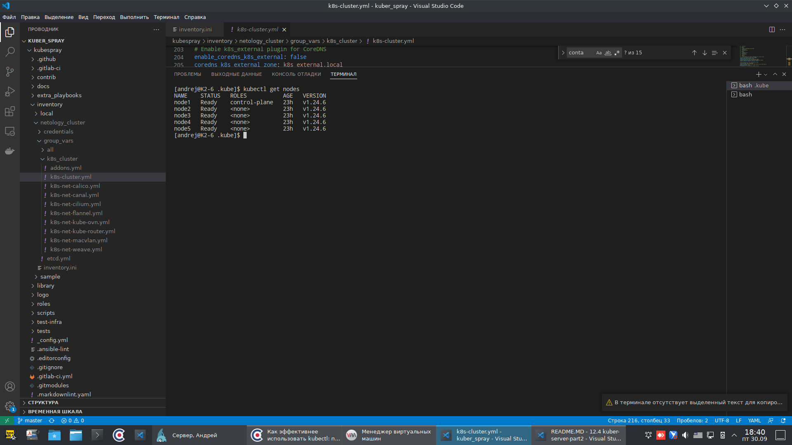

# Домашнее задание к занятию "12.4 Развертывание кластера на собственных серверах, лекция 2"

### Задание 1: Подготовить инвентарь kubespray

Новые тестовые кластеры требуют типичных простых настроек. Нужно подготовить инвентарь и проверить его работу. Требования к инвентарю:

подготовка работы кластера из 5 нод: 1 мастер и 4 рабочие ноды;
в качестве CRI — containerd;
запуск etcd производить на мастере.

---

Ответ:
Сделал 5 виртуальных Убунт. Клонировал себе репозиторий Спрея. Скопировал папку `sample`, которая в inventory. В ней поправил файл `inventory.ini` так:
```
[all]
node1 ansible_host=192.168.1.41  ansible_user=root
node2 ansible_host=192.168.1.42  ansible_user=root
node3 ansible_host=192.168.1.43  ansible_user=root
node4 ansible_host=192.168.1.44  ansible_user=root
node5 ansible_host=192.168.1.45  ansible_user=root

[kube_control_plane]
node1

[etcd]
node1

[kube_node]
node1
node2
node3
node4
node5

[calico_rr]

[k8s_cluster:children]
kube_control_plane
kube_node
calico_rr
```
Здесь первую нод сделана Мастером и на ней же etcd. Заодно сделал, чтобы Мастер  тоже мог быть рабочим. 

После полез в group_vars/k8s_cluster/k8s-cluster.yml
Нашёл там строчку `container_manager: containerd` и убедился, что там именно containerd, как по заданию.

### Вот такой получился кластер:

